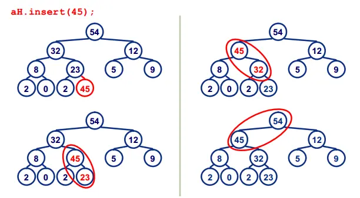
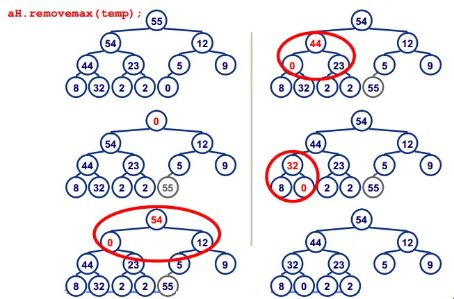

## 数据结构
堆的操作：insert
插入一个元素：新元素被加入到heap的末尾，然后更新树以恢复堆的次序。
每次插入都是将新数据放在数组最后。可以发现从这个新数据的父结点到根结点必然为一个有序的数列，现在的任务是将这个新数据插入到这个有序数据中——这就类似于直接插入排序中将一个数据并入到有序区间中。


堆的操作：Removemax
按定义，堆中每次都删除第0个数据。为了便于重建堆，实际的操作是将最后一个数据的值赋给根结点，然后再从根结点开始进行一次从上向下的调整。调整时先在左右儿子结点中找最大的，如果父结点比这个最小的子结点还大说明不需要调整了，反之将父结点和它交换后再考虑后面的结点。相当于从根结点将一个数据的“下沉”过程。



## BinaryHeap
A priority queue implemented with a binary heap.
其本质是一个用Vec实现的二叉堆（大顶堆）
```rust
pub struct BinaryHeap<
    T,
    #[unstable(feature = "allocator_api", issue = "32838")] A: Allocator = Global,
> {
    data: Vec<T, A>,
}
```

 1. BinaryHeap 是“堆”，内部要不断比较元素大小来维护结构，所以元素类型必须可排序。
  2. 在 Rust 里，BinaryHeap<T> 需要 T: Ord（全序）。
  3. Ord 又依赖 Eq + PartialOrd，Eq 又依赖 PartialEq，所以这几个 trait 通常要一起实现（或 derive）。

  这四个 trait 的作用：

  - PartialEq：定义 == / !=。
  - Eq：标记“完全相等关系”（自反、对称、传递），无方法。
  - PartialOrd：定义“可能不可比”的比较，返回 Option<Ordering>。
  - Ord：定义“总能比较”的全序，返回 Ordering。

  你这段实现的关键点：

  - BinaryHeap 默认是大顶堆（pop 出“最大”）。
  - 你在 cmp 里写了反向比较：
    other.stride.cmp(&self.stride)
  - 所以效果是“stride 越小越先出堆”，等价于最小堆行为，正好适合 stride 调度挑最小值。

  另外两个实践注意点：

  - eq 和 cmp 要一致：cmp == Equal 时应当 eq == true（你现在是按同一字段比较，符合）。
  - 放进堆后的排序键不要在“仍在堆中时”被修改，否则会破坏堆性质。通常做法是：pop -> 修改 stride/pass -> push。

  ```rust
core::cmp
pub trait Ord
where
    Self: Eq + PartialOrd<Self>,
  ```